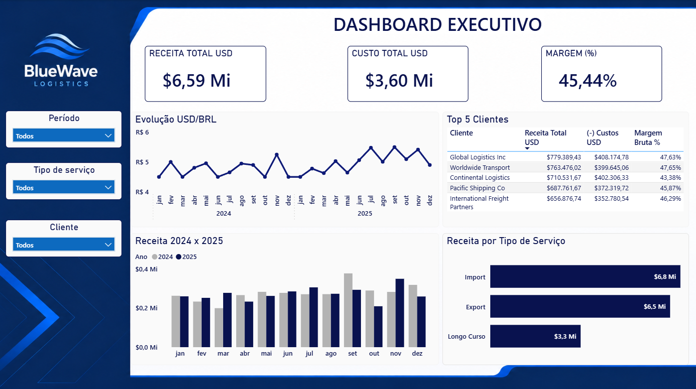

# 📊 Logistics FP&A Dashboard | Power BI

Dashboard desenvolvido em Power BI com foco na análise de desempenho financeiro de uma empresa do setor de logística.

O projeto reúne indicadores financeiros, análises de clientes, tipos de serviço, sazonalidade e comportamento do câmbio, permitindo uma visão gerencial dos principais resultados do negócio.

---

## Dashboard Executivo

<p align="center">
  
</p>

---

## Demonstrativo do Resultado do Exercício (DRE)

<p align="center">
  
</p>

---

## Objetivos

- Construir uma DRE mensal utilizando medidas em DAX;
- Desenvolver um dashboard executivo com indicadores financeiros;
- Analisar o desempenho por cliente;
- Comparar o faturamento entre os diferentes tipos de serviço;
- Avaliar a evolução da cotação USD/BRL ao longo do período;
- Identificar padrões de sazonalidade no faturamento.

---

## Tecnologias utilizadas

- Power BI
- Power Query
- DAX

---

## Estrutura do repositório

```
Financial-Performance-Dashboard/
│
├── Dashboard.pbix
├── README.md
│
└── images/
    ├── dashboard.png
    └── dre.png
```

---

## Modelagem de Dados

O modelo foi desenvolvido seguindo o conceito de modelo estrela.

As principais tabelas utilizadas foram:

**Faturamento**
- Receita, custos e margem por cliente e competência.

**Clientes**
- Informações cadastrais dos clientes.

**Rotas**
- Informações dos tipos de serviço.

**Cotações**
- Histórico diário da cotação USD/BRL.

**Apuração de Serviços**
- Receita consolidada por categoria (Export, Import e Longo Curso), utilizada nas análises por tipo de serviço.

**Calendário**
- Tabela criada em DAX para centralizar todas as análises temporais.

A tabela Calendário foi relacionada às tabelas de Faturamento, Cotações e Apuração de Serviços, enquanto Clientes e Rotas atuam como dimensões da tabela de Faturamento.

---

## Transformações realizadas

As principais transformações foram feitas no Power Query:

- Conferência e ajuste dos tipos de dados;
- Despivotamento da tabela de Apuração para obtenção das categorias Export, Import e Longo Curso;
- Padronização das colunas utilizadas nos relacionamentos.

---

## Principais medidas DAX

Entre as medidas desenvolvidas estão:

- Receita Total USD
- Custos USD
- Lucro Bruto
- Margem Bruta (%)
- Despesas Operacionais
- Lucro Operacional
- Impostos
- Lucro Líquido
- Última Cotação do Mês

---

## Dashboard

O projeto foi dividido em duas páginas principais.

**DRE**

- Demonstrativo mensal de resultados;
- Indicadores financeiros calculados em DAX;
- Filtros por período, cliente e tipo de serviço.

**Dashboard Executivo**

- KPIs financeiros;
- Evolução da cotação USD/BRL;
- Receita por tipo de serviço;
- Comparativo mensal entre 2024 e 2025;
- Ranking dos cinco maiores clientes;
- Segmentações sincronizadas entre as páginas.

---

## Principais insights

A análise permitiu identificar:

- Os clientes com maior participação na receita total;
- O desempenho financeiro de cada tipo de serviço;
- A evolução da cotação USD/BRL durante o período analisado;
- O comportamento do faturamento entre os anos de 2024 e 2025, facilitando a identificação de padrões sazonais.
